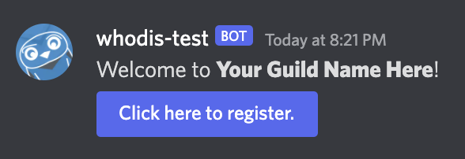
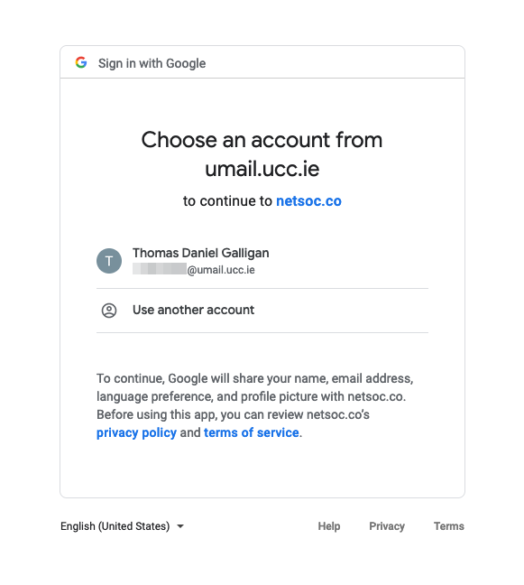

# Whodis

 

A discord bot and API to authenticate Discord members as being UCC students.

## How it works

When a new user joins your _registration channel_, they will see a message from Whodis, welcoming them to the server, and prompts them to click a button to register.

When they click the button, Whodis takes note of their Discord ID, and sends a message only they can see with a button, which will direct them to login page with their UCC Umail account as an option. After successfully choosing their Umail account, they will come to a landing page informing them of their successful authentication.

When they go back to Discord, they will have gained a role(s), giving them permission to see more of the server.

---

## How Do I Use this Bot on my Server?

A server member with Admin privileges can add the bot to their server by doing the following:

1. Invite Whodis to your Discord server.
2. Create the `@Member` role. Make this role able to access normal channels in your server.
3. Create a `#registration` and `#registration-help` channel. Make these channels incassessible by `@Member`, but allow moderators and `@everyone`. This way, only newly-joined users and moderators can see these channels.

> Note this will make it so all existing non-moderator members of your Discord server will either have to be manually given the `@Member` role, or authenticate with Whodis.

4. In the `#registration` channel, run the `/setup` command, and give the parameters you require.

| Parameter           | Required  | Description                                                             |
| ------------------- | --------- | ------------------------------------------------------------------------|
| `announce-channel`  | ✅        | The channel where new users are announc ed                              |
| `logging-channel`   | ✅        | The channel where logs are sent                                         |
| `additional-role-1` | ❌        | An additional role that can be given to new members, e.g. `@22/23`      |
| `additional-role-2` | ❌        | Another additional role that can be given to new members, e.g. `@newbies` |

---

## Need to use a different Mail Domain or want to self-host this Bot?

If you need to use a mail domain that isn't `umail.ucc.ie` you can fork this repo and use Docker to run the bot, providing a specific mail domain to use through environment variables.

To see all necessary environment variables, check [defaults.go](./config/defaults.go) (Environment variables will be in the form of UPPER_CASE).

---

## Privacy Concerns

Whodis and as such, Netsoc do not collect any personal information, as the bot and API are stateless. When a user clicks the first button, the following data is encoded into a new button:

- The User's Discord ID
- The Server's registered role, and an optional second role to give to newly-registered users.
- The server's Guild ID
- The server's welcome message Channel ID
- The server's moderator logging Channel ID

This data does not get stored on any database, and is encrypted on the backend, to stop a user tampering-with and gaining access to a role not intended for them to have.

**_Whodis does not store any Users' Discord ID or Umail address_**

---

## Help

If you have any questions or need help, please contact the Netsoc SysAdmins on [discord](https://discord.netsoc.co/), by email at [netsoc@uccsocieties.ie](mailto:netsoc@uccsocieties.ie), or [create an issue](https://github.com/UCCNetsoc/whodis/issues/new).
